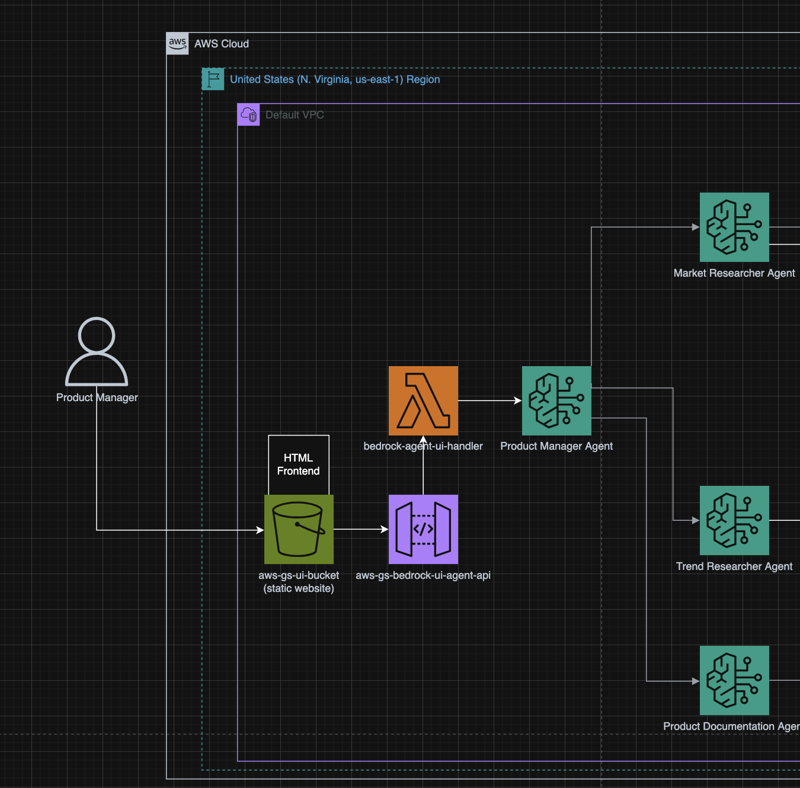

# Establish Frontend (UI) connection to Bedrock Agent

## Setup
* S3 bucket with static webiste hosting enabled
* index.html hosted in s3 bucket (send a POST Request to API Gateway)
* API Gateway (transfers HTTP-Request between frontend and Lambda function)
* Lambda function (triggered by API Gateway, recieves request and send it to assigned bedrock agent, sends respons back to API Gateway)

## How to change frontend/ui
Change the index.html file and reupload it to the s3 bucket aws-gs-ui-bucket (https://us-east-1.console.aws.amazon.com/s3/buckets/aws-gs-ui-bucket?bucketType=general&region=us-east-1&tab=objects).
The updated frontend will be deployed and visible via the provided link.
